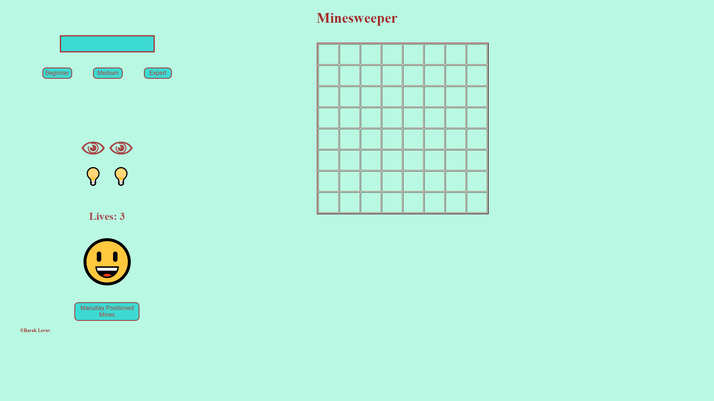
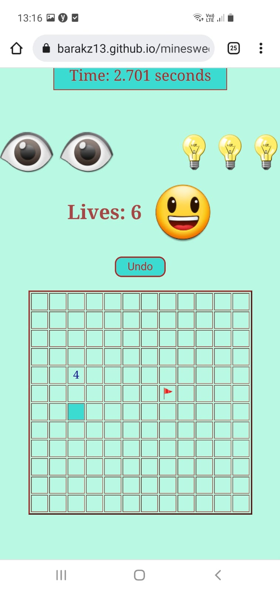

# Minesweeper

A little fun game I made at the beginning of my developing studies.

## Description
The goal is to open all the cells without mines in them and mark the cells with mines in them.
Smiley = Restart the game anytime.
Eye = Marking a safe cell for couple of seconds. Number of eyes given according to the difficulty.
Bulb = Once pressed you can press anywhere across the field and it will discover what lays beneath every unpressed cell. Number of bulbs given according to the difficulty. 
Manually positioned mines = At the beginning of the round you can decide wheter or not to manually place the mines.
Undo = Reverting one step backwards. Can be pressed up until the start of the round (clock still running).

## Software and Languages used

Vanilla JS, CSS, HTML

Hope you'd like it!

